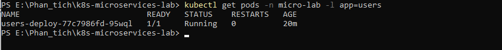

# Baitap1_Nguyen_ly_he_Phan_Tan_thuc_hanh

Bài Tập 1 nộp môn Nguyên lý hệ phân tán.

## ch6. Câu hỏi 6: Sau khi chạy kubectl apply -f users-deploy.yaml, dùng lệnh nàođể kiểm tra Pod của service users đã chạy thành công? Hãy chụp màn hình kết quả.

```powershell
kubectl get pods -n micro-lab -l app=users

```



## ch7.Câu hỏi 7: Trong file users-deploy.yaml, hãy chỉ ra:

- Deployment quản lý bao nhiêu replica ban đầu? Trả lời : 1 ("replicas: 1" line 6)
- Service thuộc loại nào (ClusterIP, NodePort, LoadBalancer)? Cluster IP (không thấy type được chỉ định, mặc định sẽ là Cluster IP)

## ch8. Câu hỏi 8: Sau khi cài Ingress, em cần thêm dòng nào vào file /etc/hosts để truy cập bằng tên miền micro.local?

Add thêm dòng

```powershell
127.0.0.1 micro.local

```

vì dùng minikube tunnel
